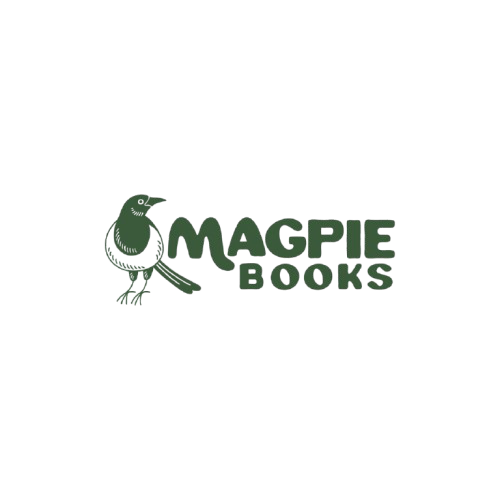
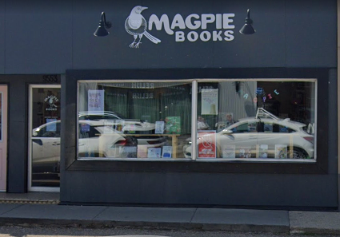
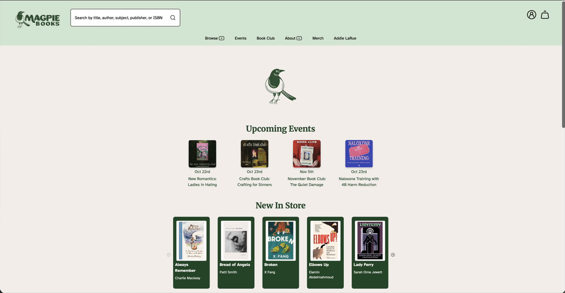

  

# Magpie Books Redesign

Built by A.J. Neufeld — DESN 340 (Web Design & Development).

An accessibility-first redesign and static implementation for Magpie Books, an independent Edmonton bookstore.

> **Note:** This is an independent student project created for DESN 340 (Web Design & Development), Fall 2025. It is not Magpie Books’ official website or online store.

## Overview

I redesigned Magpie Books’ website after auditing the existing experience. The original site was difficult to use on slow connections, unavailable without JavaScript, and organized page content in a way that made it difficult to navigate with assistive technology.

The redesign focuses on familiar navigation, readable typography, semantic HTML, and an interface that works as a static website rather than relying on a framework or build step.

Live demo: **[creativetechie7.github.io/DESN340-MagpieBooksRedesign](https://creativetechie7.github.io/DESN340-MagpieBooksRedesign/)** \
Portfolio case study: **[ajneufeld.ca/magpiebooks.html](https://ajneufeld.ca/magpiebooks.html)**

### Homepage walkthrough

Click to play the full homepage walkthrough.

### Accessibility page

## Included pages and interactions

- Homepage with new releases, events, and staff picks
- Staff picks page featuring recommendations from individual booksellers
- Book-detail page for _The Invisible Life of Addie LaRue_
- FAQ with expandable sections
- Accessibility page with store, delivery, transit, and parking information
- Responsive mobile navigation
- Client-side catalogue search and carousel interactions

## Accessibility work

Accessibility was the main focus of this project. Key implementation decisions include:

- Semantic page structure with landmark regions and heading hierarchy
- Meaningful image alt text and decorative-image handling
- Accessible labels for navigation, controls, and social links
- Visible keyboard focus styles
- Form labels and keyboard-operable interactive controls
- Atkinson Hyperlegible for interface text, paired with Merriweather
- A dedicated accessibility-information page with structured sections instead of a flat wall of text

The project was designed with WCAG 2.1 AA guidance in mind. It is a course project, so there are still areas I would revisit in a future iteration, including more comprehensive keyboard and screen-reader testing.

## Tech Stack

| **Component**     | **Technology**                                                                                                    | **Description**                                                                                        |
| :---------------- | :---------------------------------------------------------------------------------------------------------------- | :----------------------------------------------------------------------------------------------------- |
| **Markup**        |                   | Semantic HTML across five pages: home, staff picks, book detail, FAQ, and accessibility.               |
| **Styling**       |                      | Custom CSS, responsive layouts, CSS custom properties, and `normalize.css`.                            |
| **Scripting**     |    | Vanilla JavaScript for search, carousels, FAQ toggles, mobile navigation, and book-order interactions. |
| **Fonts / Icons** | Google Fonts, Iconoir                                                                                             | Atkinson Hyperlegible and Merriweather typefaces with Iconoir icons.                                   |
| **Deployment**    |  | Static deployment via GitHub Pages.                                                                    |

## Project scope

This is a static front-end prototype. It does not include a CMS, user accounts, inventory integration, checkout, or live ordering.
